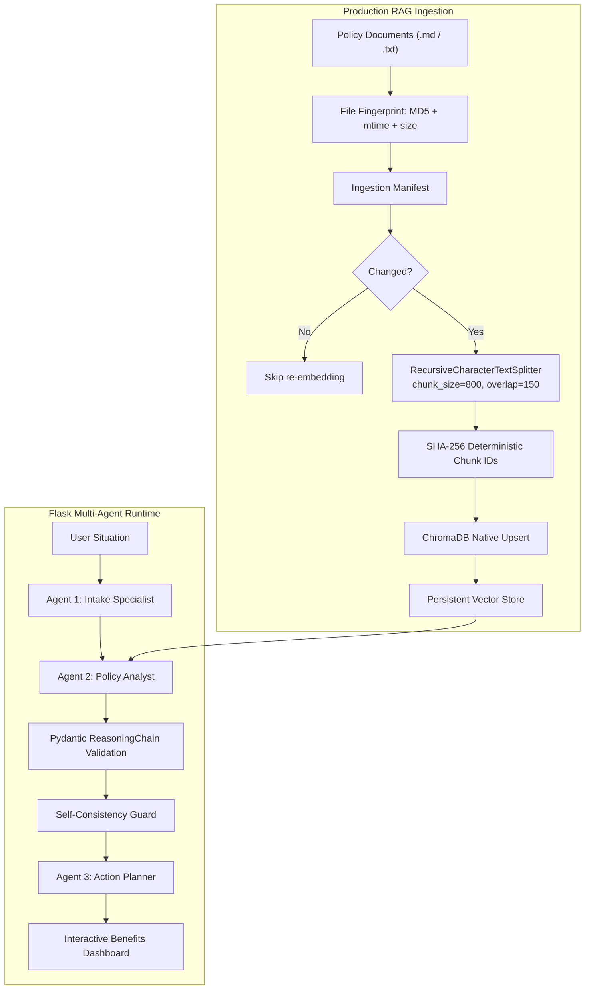

# CivicEase AI - Benefits Navigator

CivicEase AI is a multi-agent benefits navigation platform that transforms a user's natural-language situation into structured eligibility signals, policy-grounded benefit assessments, and a practical action plan.

The system combines Flask, LangChain, ChromaDB, Groq-hosted LLMs, Pydantic validation, and a production-grade retrieval pipeline designed for legal and financial policy documents. CivicEase AI is built around a reliability-first architecture: every recommendation must be grounded in retrieved policy context, validated through structured schemas, and converted into cautious, user-safe guidance.

## Core Value Proposition

Public assistance programs in the United States are fragmented across federal rules, state-specific thresholds, local administrative names, and frequently changing eligibility criteria. CivicEase AI reduces that complexity by providing:

- Empathetic conversational intake that extracts household size, income, location, urgency, and needs.
- Location-aware RAG retrieval over a 50-state benefits knowledge base.
- Inductive policy reasoning constrained to retrieved documents.
- Structured Pydantic validation for LLM outputs.
- Self-consistency guardrails that remove matches contradicted by the model's own reasoning.
- A user-facing action dashboard with practical next steps and safe support contacts.

## System Architecture

CivicEase AI uses two coordinated pipelines: a background-capable ingestion pipeline for policy freshness and a runtime three-agent pipeline for user guidance.



### Runtime Agent Pipeline

**Agent 1: Intake Specialist** (`agents/intake_agent.py`)

Extracts eligibility-relevant variables from the conversation, including location, household size, income, age signals, urgency, and specific needs. If required information is missing, the pipeline pauses and asks a clarification question instead of guessing. A Python-level solo-individual fallback (`_infer_solo_individual`) supplements LLM extraction: when user text contains unambiguous solo-living signals (such as "living alone" or "just me") and no household-member signals, `family_size` is programmatically set to 1 without relying on the LLM.

**Agent 2: Policy Analyst** (`agents/policy_agent.py`)

Normalizes location, retrieves state-relevant policy chunks from ChromaDB, filters noisy context, and evaluates likely benefit eligibility using a strict inductive reasoning protocol. The model is instructed to rely only on retrieved policy documents.

**Agent 3: Action Planner** (`agents/action_agent.py`)

Converts validated policy matches into practical checklist steps, support contacts, documentation requirements, and cautious next-best actions.

## Production RAG Ingestion

CivicEase AI was upgraded from a basic rebuild-oriented RAG workflow to a manifest-based incremental sync architecture.

### Manifest-Based Incremental Sync

Each source document is tracked in `chroma_db/ingestion_manifest.json` with:

- `md5`: content hash for change detection.
- `last_modified_ns`: filesystem modification timestamp.
- `size_bytes`: source file size.
- `chunk_count`: number of generated chunks.
- `chunk_size` and `chunk_overlap`: splitter configuration used for reproducibility.

During ingestion, CivicEase AI compares the current fingerprint of each source file against the manifest. Unchanged files are skipped. Changed files are reprocessed. Deleted files have only their own stale chunks removed from ChromaDB.

This avoids full vector database wipes and supports efficient, low-risk policy updates.

### Recursive Chunking for Policy Context

The ingestion pipeline uses LangChain's `RecursiveCharacterTextSplitter` with the production configuration:

```python
CHUNK_SIZE = 800
CHUNK_OVERLAP = 150
```

This configuration preserves dense legal and financial context across chunk boundaries while keeping retrieval units compact enough for semantic search. The overlap is important for benefits policy because income thresholds, exceptions, and eligibility rules often span adjacent paragraphs.

### Deterministic SHA-256 Chunk IDs

Every chunk receives a deterministic SHA-256-based ID derived from:

- Source filename.
- State or metadata tag.
- Chunk start position.
- Chunk content hash.

Because the same content maps to the same ID, repeated ingestion does not create duplicate vectors. This keeps retrieval results cleaner and reduces noise in the policy context passed to the LLM.

### ChromaDB Native Upsert

The system writes chunks using ChromaDB's native `upsert` behavior. If a chunk ID already exists, the vector and metadata are updated in place. If the ID is new, it is inserted. This guarantees data freshness without deleting the entire vector store.

### Background Ingestion Worker

`core/background_ingestion.py` provides an APScheduler-based background worker. It can be enabled through environment variables:

```env
CIVICEASE_ENABLE_BACKGROUND_INGESTION=true
CIVICEASE_INGESTION_INTERVAL_MINUTES=30
CIVICEASE_SCHEDULER_TIMEZONE=UTC
```

When enabled, the worker runs incremental ingestion in the background while Flask continues serving API traffic. The same job contract can later be moved to Celery beat, Kubernetes CronJobs, or a managed cloud scheduler.

## Responsible AI Guardrails

CivicEase AI uses layered safeguards to reduce hallucination risk and improve user safety.

### L1: Retrieval Guard

The retriever applies metadata filters where possible, especially state-level filtering. A context-filtering step removes low-signal chunks before the LLM receives policy context.

### L2: Schema Guard

LLM output is parsed into strict Pydantic models, including a four-step `ReasoningChain`:

1. Extract policy criteria from retrieved context.
2. Extract user data from the profile.
3. Compare user data against policy criteria.
4. Produce a cautious eligibility conclusion.

Malformed JSON is repaired where possible. Invalid or incomplete outputs fall back safely rather than crashing the user workflow.

### L3: Self-Consistency Guard

If the model's own reasoning states that the user is ineligible, over the income limit, or does not qualify, the system removes that match before producing the final action plan.

This guard does not hard-code income tables. It enforces consistency between retrieved policy evidence, model reasoning, and final output.

The evaluation taxonomy also includes state-branded aliases for programs in states such as California, New York, Florida, Ohio, and Georgia, reducing false hallucination flags when the model uses official regional benefit names.

## Impact and Verification

Judges can verify the ingestion efficiency directly.

### 0. Run the RAG Integrity Check

Before testing the full application, run the dedicated QA script:

```bash
python scripts/verify_rag_integrity.py
```

This verifies that:

- `chroma_db/ingestion_manifest.json` exists and is valid JSON.
- Manifest records contain the expected MD5, timestamp, file size, and chunk configuration fields.
- Chunk IDs are deterministic across repeated chunking runs.
- A mock file update changes the fingerprint as expected.
- The test is non-destructive and uses a temporary file copy for update simulation.

### 1. Build or Sync the Vector Store

```bash
python core/rag_engine.py
```

After a first successful sync, the output should indicate that changed files were processed:

```text
Vector DB sync complete: 1 processed, 0 skipped, 0 removed.
```

### 2. Run the Same Command Again Without Editing Data

```bash
python core/rag_engine.py
```

Because the manifest detects that the source file has not changed, the system skips re-embedding:

```text
Vector DB sync complete: 0 processed, 1 skipped, 0 removed.
```

This demonstrates that CivicEase AI performs incremental synchronization instead of expensive full database rebuilds.

### 3. Modify One Policy Document

Edit a `.md` or `.txt` file inside `data/`, then run:

```bash
python core/rag_engine.py
```

Only the changed source file is reprocessed. Unchanged files remain skipped. If a source file was removed, only chunks belonging to that file are removed from ChromaDB.

### 4. Verify Deterministic Chunking

The manifest records the splitter configuration and chunk count. For the included knowledge base, the current pipeline produces 800-character chunks with 150-character overlap. Re-running ingestion on unchanged content preserves deterministic IDs and avoids duplicate vector entries.

## Evaluation

Run the evaluation harness:

```bash
python scripts/run_eval.py
```

The evaluation suite validates representative profiles across multiple states and checks:

- Intake extraction accuracy.
- Policy match quality.
- Structured reasoning completeness.
- URL and certainty guardrails.
- Hallucination-related failure modes.

State-branded program names (for example, `TEXAS MEDICAID`, `MEDI-CAL`, and `CALFRESH`) are normalized to their federal equivalents (`MEDICAID` and `SNAP`) before scoring using the `normalize_benefit_name()` function. This prevents false-negative F1 penalties when the LLM correctly identifies a program but uses a state-specific name. The hallucination taxonomy (`ALLOWED_BENEFITS_TAXONOMY`) covers state-branded aliases for California, New York, Florida, Ohio, and Georgia in addition to all standard federal program names.

Run the RAG integrity check separately when validating ingestion behavior:

```bash
python scripts/verify_rag_integrity.py
```

The output report is saved to:

```text
data/eval_report.json
```

## Technical Validation Summary

| Capability | Implementation |
|---|---|
| Framework | Flask |
| Agent orchestration | Three-agent Python pipeline |
| LLM provider | Groq via LangChain |
| Retrieval | LangChain + ChromaDB |
| Embeddings | HuggingFace sentence-transformer model |
| Chunking | `RecursiveCharacterTextSplitter`, 800/150 |
| Incremental sync | Manifest with MD5, mtime, size, chunk count |
| Chunk identity | SHA-256 deterministic IDs |
| Vector writes | ChromaDB native upsert |
| Background updates | APScheduler worker |
| Validation | Pydantic v2 schemas |
| Safety | Retrieval filtering, JSON repair, self-consistency filtering |
| QA verification | `scripts/verify_rag_integrity.py` |

## Installation

### Prerequisites

- Python 3.10 or 3.11
- Groq API key
- Internet access on first vector sync if the embedding model is not already cached locally

### Automated Setup

Windows PowerShell:

```powershell
.\setup.ps1
```

macOS or Linux:

```bash
bash setup.sh
```

### Manual Setup

Create and activate a virtual environment:

```bash
python -m venv venv
```

Windows PowerShell:

```powershell
.\venv\Scripts\Activate.ps1
```

macOS or Linux:

```bash
source venv/bin/activate
```

Install dependencies:

```bash
pip install -r requirements.txt
```

Copy environment configuration:

```bash
cp .env.example .env
```

Set your Groq key:

```env
GROQ_API_KEY=your_groq_api_key_here
```

Build or sync the vector database:

```bash
python core/rag_engine.py
```

Run the Flask application:

```bash
python app.py
```

Open:

```text
http://127.0.0.1:5000
```

## Configuration

Common environment variables:

```env
GROQ_API_KEY=your_groq_api_key_here
GROQ_MODEL_NAME=llama-3.1-8b-instant
EMBEDDING_MODEL_NAME=all-MiniLM-L6-v2
CHROMA_COLLECTION_NAME=langchain
FLASK_HOST=127.0.0.1
FLASK_PORT=5000
FLASK_DEBUG=false
LOG_LEVEL=INFO
CIVICEASE_ENABLE_BACKGROUND_INGESTION=false
CIVICEASE_INGESTION_INTERVAL_MINUTES=30
CIVICEASE_SCHEDULER_TIMEZONE=UTC
```

## Project Structure

```text
CivicEase-main/
|-- app.py                          # Flask server and API routes
|-- requirements.txt                # Python dependencies
|-- README.md                       # Project documentation
|-- agents/
|   |-- intake_agent.py             # Agent 1: intake extraction
|   |-- policy_agent.py             # Agent 2: RAG policy analysis
|   `-- action_agent.py             # Agent 3: action planning
|-- core/
|   |-- rag_engine.py               # Incremental ChromaDB ingestion and retriever
|   `-- background_ingestion.py      # APScheduler ingestion worker
|-- data/
|   |-- civicease_knowledge_base.md # 50-state policy knowledge base
|   `-- eval_report.json            # Evaluation output
|-- scripts/
|   |-- run_eval.py                 # Evaluation harness
|   |-- populate_states.py          # Knowledge base utilities
|   `-- verify_rag_integrity.py     # RAG ingestion integrity checks
|-- static/
|   |-- css/app.css                 # Frontend styling
|   `-- js/app.js                   # Frontend behavior
`-- templates/
    `-- index.html                  # Flask dashboard template
```

## MCP Roadmap

The codebase includes architectural placeholders for future Model Context Protocol adoption. The intended direction is to expose the RAG and policy access layer as standardized tools such as:

- `civicease.policy_vector_search`
- `civicease.policy_document_upsert`
- `civicease.external_policy_api`

This would standardize how the three-agent pipeline connects to ChromaDB and trusted external policy APIs, with typed inputs, auditable outputs, scoped credentials, and least-privilege access.

## Responsible AI Position

CivicEase AI is not a benefits approval authority. It is a preparation and navigation assistant. The system uses cautious language, policy-grounded citations, validation layers, and retrieval-based constraints to reduce unsafe certainty.

The production RAG upgrade directly supports Responsible AI: by ensuring policy data can be refreshed incrementally and automatically, CivicEase AI reduces the risk of serving stale legal eligibility criteria to vulnerable users.

## Team

This project was developed by Yossif Ahmed (@yossifmesalam81) and Moaaz Yasser (@moaazyasser60). We would like to acknowledge the initial contributions of our team members during the qualification phase.
