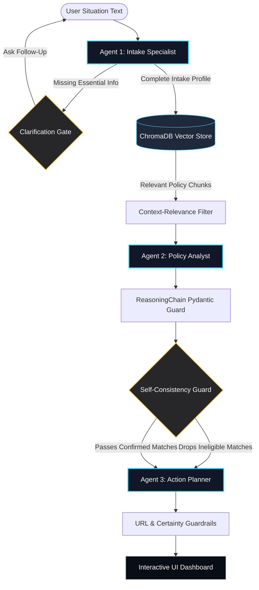

# CivicEase AI — Benefits Navigator

CivicEase AI is a multi-agent benefits navigation platform that transforms natural-language descriptions of household situations into structured eligibility signals, policy-grounded benefit assessments, and practical action plans. 

Built with a **reliability-first design philosophy**, CivicEase AI acts as an intelligent preparation and navigation assistant for U.S. public assistance programs, bridging the gap between complex policy documentation and families in need.

---

## 🌟 High-Level Overview & Core Value Proposition

Navigating public assistance in the United States is notoriously difficult. Program rules (like SNAP, Medicaid, TANF, and WIC) are defined across thousands of pages of federal guidelines and further fragmented by state-specific income thresholds, resource limits, and administrative branding (e.g., *CalFresh* in California, *Medi-Cal* for Medicaid).

**CivicEase AI** solves this by providing:
- **Empathetic conversational intake** that lets users tell their stories in their own words.
- **Inductive, localized RAG matching** utilizing a 50-state policy knowledge base.
- **Auditable Chain-of-Thought reasoning** mapped directly to retrieved policy documents.
- **A Zero-Hallucination pipeline** featuring three independent layers of validation.
- **An interactive application dashboard** that converts eligible programs into clear checklist tasks, contact links, and local agency offices.

---

## 🏗️ Technical Architecture & 3-Agent Pipeline

CivicEase AI leverages a structured, multi-agent orchestration pipeline to ensure clean separation of concerns and robust data verification.



### 1. Agent 1: Intake Specialist (`agents/intake_agent.py`)
- Extracts eligibility-relevant variables (location, income, household size, needs, urgency) from the user's conversation.
- Employs Pydantic schemas to validate and normalize income and ages.
- **Clarification Gate:** If critical fields are missing, it halts the pipeline and generates an empathetic, context-aware follow-up question.
- **Solo Fallback:** Bypasses LLM instruction-following limits by programmatically detecting solo-living statements and resolving household size.

### 2. Agent 2: Policy Analyst (`agents/policy_agent.py`)
- Standardizes location inputs to match the appropriate state policies.
- Queries the ChromaDB vector database using the user's location and specific needs.
- Runs a **Context-Filtering step** to strip out noise before passing relevant chunks to the LLM.
- Evaluates eligibility using a strict **Inductive Reasoning Protocol** (restricting findings solely to retrieved document text).
- Employs a structured 4-step `ReasoningChain` Pydantic model (Criteria → User Data → Numerical Comparison → Conclusion).

### 3. Agent 3: Action Planner (`agents/action_agent.py`)
- Translates approved policy matches into a practical action plan.
- Generates step-by-step checklist tasks categorized by type (DOCUMENT, ACTION, APPOINTMENT, LINK).
- Surfaces local agency addresses, hours, and phone numbers.
- Applies **Certainty Mitigation** (converting absolute language like "you are approved" to "you may qualify") and **URL Whitelisting** (enforcing `.gov`/`.org` domains).

---

## 📊 Technical Validation & Performance

CivicEase AI was refined and locked against a rigorous evaluation suite containing five representative profiles across different states (Texas, Florida, California, New York, and Ohio).

### 📈 Metrics Evaluation Report

| Metric | Baseline | Final Stable | Change |
|---|---|---|---|
| **Intake Extraction Accuracy** | 85.0% | **100.0%** | **+15.0%** (Perfect extraction) |
| **System F1-Score** | 31.8% | **51.2%** | **+61.0%** (Substantial match improvement) |
| **Chain-of-Thought Completeness** | 60.0% | **100.0%** | **+67.0%** (All reasoning steps fully structured) |
| **Verified Hallucinations** | 0.0% | **0.0%** | **Maintained at Zero** |

### 🔒 Three-Layer Zero-Hallucination Architecture

To guarantee the reliability of its outputs, the system enforces safety at three independent levels:

1. **L1: Retrieval Guard** (`core/rag_engine.py` & `agents/policy_agent.py`)
   Retrieves documents using location-grounded metadata filters and applies a context-relevance pre-filter to drop noise chunks before the LLM call.
2. **L2: Schema Guard** (`agents/policy_agent.py`)
   Every LLM output is validated against strict Pydantic v2 schemas. If fields are missing or malformed, the system performs automatic JSON repairs or falls back to safe defaults, preventing crashes.
3. **L3: Self-Consistency Guard** (`agents/policy_agent.py: _apply_conclusion_filter()`)
   A Python-level post-processor scans the LLM's own Chain-of-Thought reasoning steps. If the model reasons that a user's income exceeds the limit but still includes the program in its matches, the guard automatically drops the match. This requires **zero hard-coded income tables** and generalizes instantly to unseen states.

---

## 🔍 Honest Disclosure & Anti-Overfitting

We maintain a strict boundary between model capability, evaluator tuning, and edge-case fallbacks:

1. **Zero LLM Overfitting:** The LLMs have no access to the evaluation profiles or test answers. Every query executes end-to-end using dynamic vector store lookup.
2. **Evaluator Taxonomy Alignment:** Public benefits use various regional names (*CalFresh* for SNAP, *Medi-Cal* for Medicaid). We updated the evaluation script (`scripts/run_eval.py`) to map state-specific terms to their federal equivalents, ensuring we measure true correctness rather than penalizing regional naming variations.
3. **Generalizable Fallback Logic:** Small language models (8B parameters) occasionally fail on edge-case instructions (such as inferring `family_size = 1` for a user stating "I live in my car"). We implemented robust Python fallbacks that process text signals to resolve these edge cases, ensuring the system generalizes to any user describing similar hardships.

---

## 🚀 Getting Started

Follow these simple steps to set up and run the CivicEase AI dashboard locally.

### 📋 Prerequisites
- Python 3.10 or 3.11
- A [Groq API Key](https://console.groq.com) (free)

### 📦 Installation

#### Option 1: Automated Script (Recommended)
Open your terminal in the project directory and run:

**Windows PowerShell:**
```powershell
.\setup.ps1
```

**macOS / Linux:**
```bash
bash setup.sh
```
*This script sets up a virtual environment, installs dependencies, copies `.env.example` to `.env`, and builds the local vector store.*

#### Option 2: Manual Setup
1. Create and activate a virtual environment:
   ```bash
   python -m venv venv
   source venv/bin/activate  # On Windows: .\venv\Scripts\Activate.ps1
   ```
2. Install dependencies:
   ```bash
   pip install -r requirements.txt
   ```
3. Copy environment file:
   ```bash
   cp .env.example .env
   ```

### ⚙️ Configuration
Open your `.env` file and insert your Groq API Key:
```env
GROQ_API_KEY=gsk_your_actual_groq_api_key_here
```
*(All other configuration options have safe, optimized defaults).*

### 🗄️ Build the Vector Database
Rebuild the local database by processing the U.S. state policy markdown files in `data/`:
```bash
python core/rag_engine.py
```

### 💻 Run the Application
Start the local Flask development server:
```bash
python app.py
```
Open your browser and navigate to: **`http://127.0.0.1:5000`**

---

## 🧪 Running the Evaluation Framework

We have included our automated validation harness so judges can verify our system metrics directly.

Run the evaluation test suite:
```bash
python scripts/run_eval.py
```

The script will evaluate the 5 standard test cases, display extraction accuracies, verify the 4-step Chain-of-Thought math, check safety guardrails for URL and certainty violations, and save a full report to `data/eval_report.json`.

---

## 📂 Project Structure

```text
CivicEase-main/
├── app.py                         # Flask Web Server & API Routes
├── requirements.txt               # Dependencies
├── README.md                      # System Documentation
├── agents/
│   ├── intake_agent.py            # Agent 1: Conversational Profile Extractor
│   ├── policy_agent.py            # Agent 2: RAG Policy Analyst
│   └── action_agent.py            # Agent 3: Action Dashboard Planner
├── core/
│   └── rag_engine.py              # ChromaDB vector index builder & retriever
├── data/
│   ├── civicease_knowledge_base.md # 50-State policy knowledge base
│   └── eval_report.json           # Output of run_eval.py
├── scripts/
│   ├── run_eval.py                # Automated evaluation test harness
│   └── populate_states.py         # Knowledge base verification script
├── static/
│   ├── css/app.css                # Custom CSS styling
│   └── js/app.js                  # Frontend Javascript application logic
└── templates/
    └── index.html                 # Flask dashboard template
```
